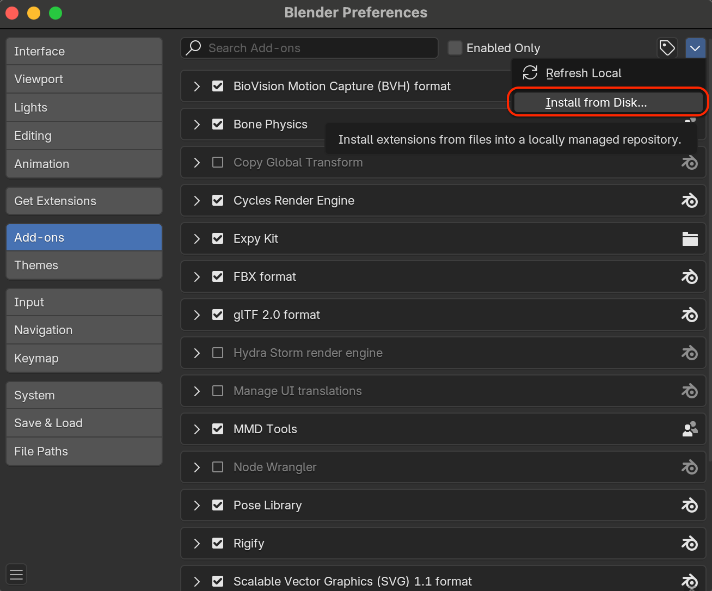

Installation
============

.. _INSTALLATION:

Installing the extension
---------------------------
.. important::
    | Do not unzip the downloaded files!

1. In Blender, click :menuselection:`Edit --> Preferences --> Add-ons`.
2. Click the down arrow in the top-right corner and choose :menuselection:`--> Install from Disk...`

|

Remove the extension
-----------------------

If the add-on does not provide an **Uninstall** button:

1. Open `Blender` and go to :menuselection:`Edit --> Preferences --> Add-ons`.
2. Locate **Bone Physics** in the list and uncheck it to disable the add-on.
3. Manually delete the add-on folder from your `Blender` extension directory.
4. Restart `Blender`

.. note::
   | The default extension directory is usually located at:

   - `MacOS`: ``~/Library/Application Support/Blender/4.2/extensions/user_default/``
   - `Windows`:
   - `Linux`:

   The exact path may vary depending on your `Blender` configuration.
   You should not rely entirely on these paths, check the `File` path instead.

   .. image:: images/blender_remove_addon.png
	   :align: center
  