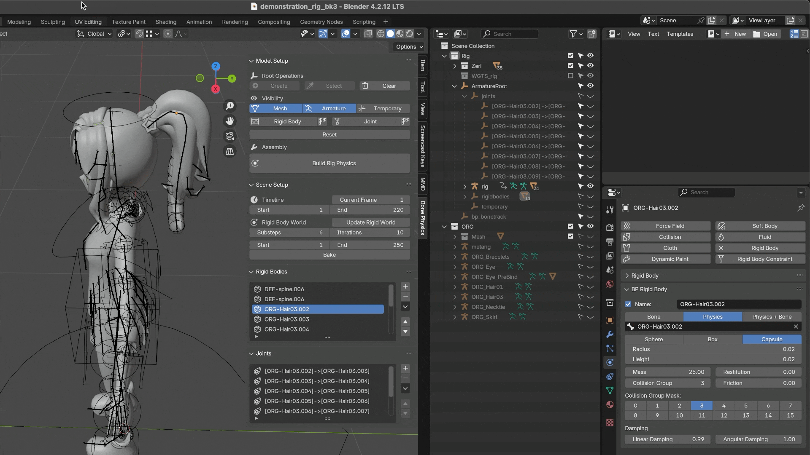
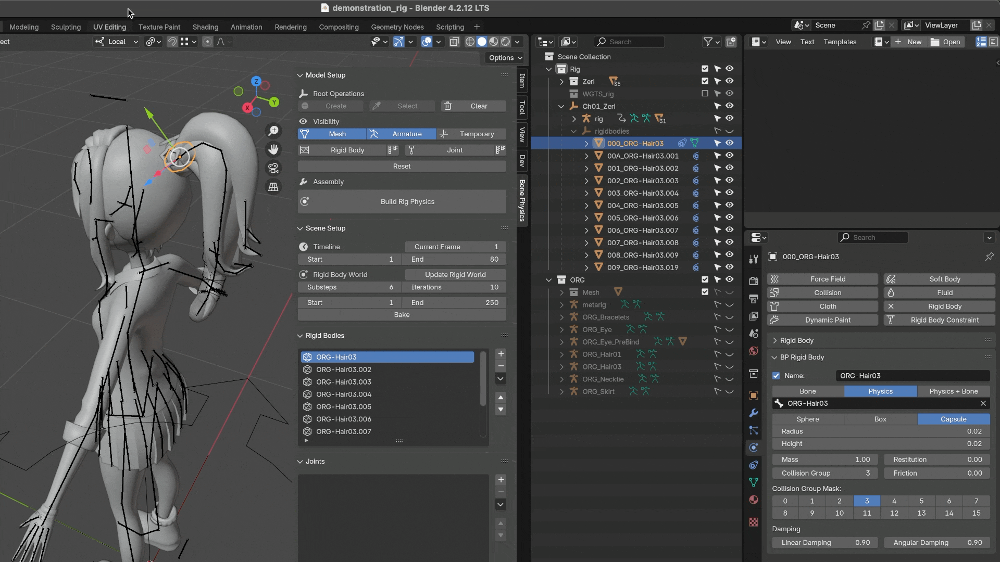
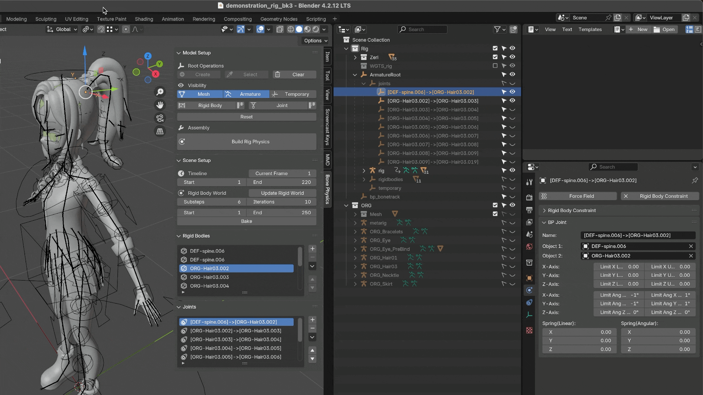
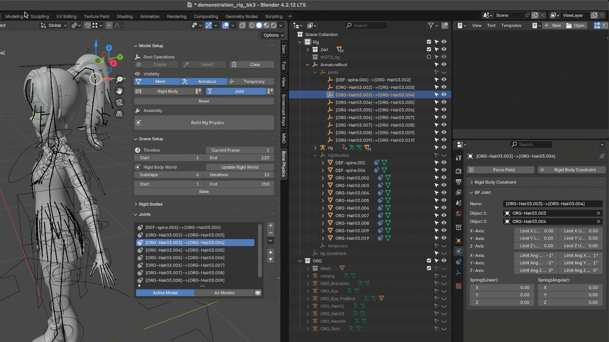
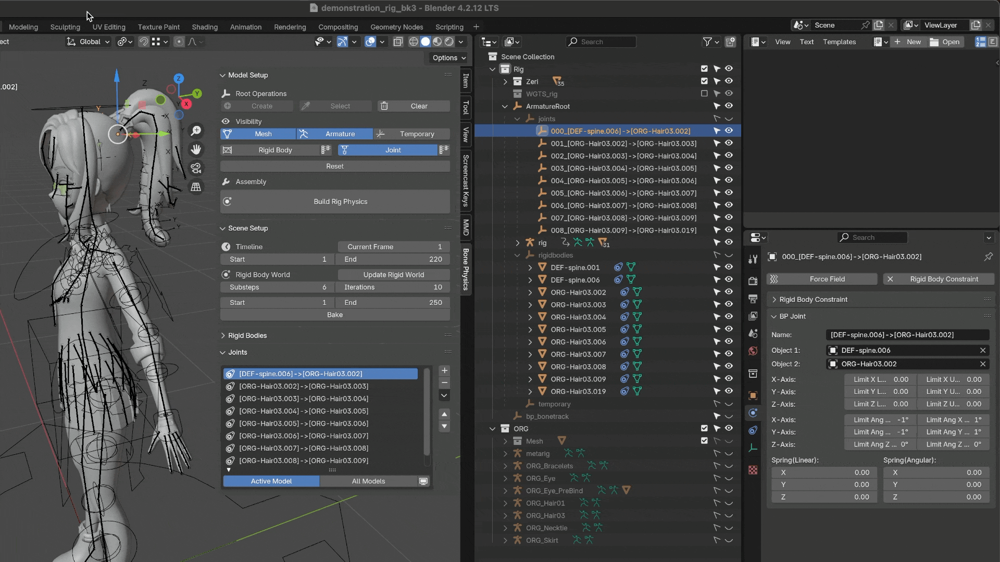
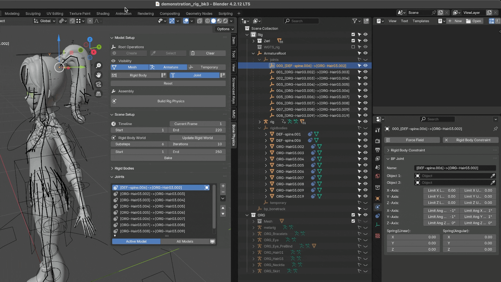

Joint
==============

Add Joint
--------------

Add a Joint Between Two Rigid Bodies
^^^^^^^^^^^^^^^^^^^^^^^^^^^^^^^^^^^^
1. Switch to *Object Mode* and select the two rigid bodies to which you want to add a constraint.  
2. Click the **➕ button**.  
3. Configure the joint properties, then press **OK** to finish.

|

Add Joints Along a Bone Chain
^^^^^^^^^^^^^^^^^^^^^^^^^^^^^^
1. Switch to *Object Mode* and select all the rigid bodies along the bone chain that require constraints.  
   (You can select multiple rigid bodies at once. See also :ref:`Select Rigid Bodies <select_rigid_bodies>`.)  
2. Click the **➕ button**.  
3. Configure the joint properties, then press **OK** to finish.

|

.. warning::
    When both bone-chain rigid bodies (e.g. A, B, C) and non-chain rigid bodies (e.g. D, E) are selected,  
    the add-on will only create joints between the bone-chain rigid bodies (A, B, C).  
    The others (D, E) will be ignored.

.. note::
   * Adjacent rigid bodies from **different bone chains** can only be connected **one pair at a time** —  
     batch operations are not supported in this case.  
     For example, when adding joints between rigid bodies belonging to different skirt bone chains,  
     you must add them individually.  
     This limitation exists because each model has unique structures and assumptions;  
     we prioritize flexibility and compatibility over full automation.  
     Although this may appear repetitive, in practice, using **presets** can still make the workflow quite efficient.  
     (See also: *Adding Joints for Skirt Rigid Bodies*.)

   * While it is technically possible to create **multiple joints between the same pair of rigid bodies**,  
     do so with caution.  
     If you accidentally create duplicates when only one joint is needed,  
     the simulation results may differ from your expectations.  
     You can verify duplicates in the :ref:`Joint List <joint_list>` and `Outliner`

     .. image:: images/addon_redundant_joints.png
        :align: center

Save Presets
^^^^^^^^^^^^^^
See also: :ref:`Rigid Body Save Presets <save_presets>`

.. _joint_properties:

Joint Properties
----------------------

- **name**: The name of the joint.  

- **limit_lin_x_upper**: Upper limit of linear motion along the **X** axis.  
- **limit_lin_y_upper**: Upper limit of linear motion along the **Y** axis.  
- **limit_lin_z_upper**: Upper limit of linear motion along the **Z** axis.  
- **limit_lin_x_lower**: Lower limit of linear motion along the **X** axis.  
- **limit_lin_y_lower**: Lower limit of linear motion along the **Y** axis.  
- **limit_lin_z_lower**: Lower limit of linear motion along the **Z** axis.  

- **limit_ang_x_upper**: Upper angular limit around the **X** axis (in degrees).  
- **limit_ang_y_upper**: Upper angular limit around the **Y** axis (in degrees).  
- **limit_ang_z_upper**: Upper angular limit around the **Z** axis (in degrees).  
- **limit_ang_x_lower**: Lower angular limit around the **X** axis (in degrees).  
- **limit_ang_y_lower**: Lower angular limit around the **Y** axis (in degrees).  
- **limit_ang_z_lower**: Lower angular limit around the **Z** axis (in degrees).  

- **spring_linear**: The spring stiffness that controls linear motion.  
  Higher values produce stronger resistance when the joint is displaced.  

- **spring_angular**: The spring stiffness that controls angular (rotational) motion.  
  Higher values produce stronger torque resistance when the joint is rotated.  

.. note::
   The parameters above correspond to Blender's built-in *Rigid Body Constraint* properties.  

.. _joint_properties_panel:

Joint Properties Panel
----------------------------

The **Joint Properties Panel** is where you can view and edit all joint-related attributes.  
It can be found under the **Physics** tab in Blender.  

|

.. _joint_list:

Joint List
----------------

The **Joint List** displays all joints (rigid body constraints) in the current scene.  
By default, it filters by **Active Model**, showing only the joints associated with the currently selected model.  
To view joints from **all models**, change the filter to **All Models**.

.. image:: images/addon_joint_list.gif
   :align: center

|

Reordering List Items
^^^^^^^^^^^^^^^^^^^^^^^^^^^^
You can reorder list items using the ⬆ and ⬇ buttons, or through the right-side dropdown menu options:  
**Move To Top** and **Move To Bottom**.

|

Error Icon Indicators
^^^^^^^^^^^^^^^^^^^^^^^^^^^^

Missing Joint
~~~~~~~~~~~~~~~~
A **"Missing Joint"** error icon appears when the list entry has no valid **Rigid Body Constraint** data.  
This usually occurs when the joint was deleted from Blender's constraint system but still exists in the add-on's list.  
To fix this, recreate the joint using the **Add Rigid Body Constraint** button in the :ref:`Joint Properties Panel <joint_properties_panel>`.

|

Missing Linked Objects
~~~~~~~~~~~~~~~~~~~~~~~
A **"Missing Linked Objects"** warning icon appears when one or both of the rigid bodies linked by the joint are missing.  
For example, if `Object1` or `Object2` is not assigned, the joint cannot function properly.  
You can reassign the missing objects in the :ref:`Joint Properties Panel <joint_properties_panel>`.

|

.. tip::
   It is generally recommended to assign the **static** or **bone-driven** rigid body as ``Object1``,  
   and the **simulated** rigid body as ``Object2``.  
   This setup ensures a more stable and predictable constraint behavior,  
   as Blender internally treats ``Object1`` as the reference frame for the joint's position and rotation limits.

Invalid Joint Pair
~~~~~~~~~~~~~~~~~~~~
An **"Invalid Joint Pair"** icon appears when both linked objects (`Object1` and `Object2`) refer to the **same rigid body**.  
This setup is invalid because a joint requires two distinct rigid bodies.  
Recreate the joint with two different rigid bodies to resolve this issue.

.. image:: images/addon_joint_invalid_pair.gif
   :align: center

|

Remove Joint
-------------------

Select a joint in the **3D View**, the **Joint List**, or the **Outliner**,  
then click the **➖ button** to remove it.

See also: :ref:`Remove Rigid Body <remove_rigid_body>`.
