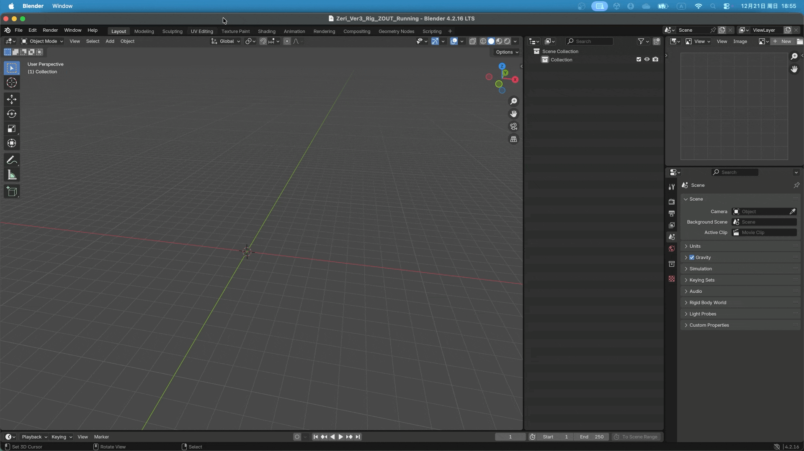
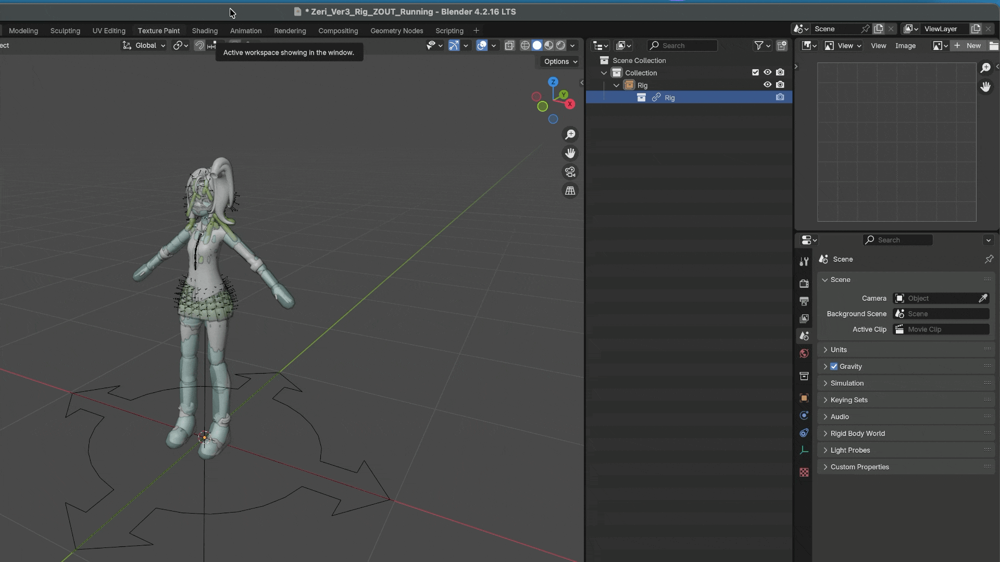
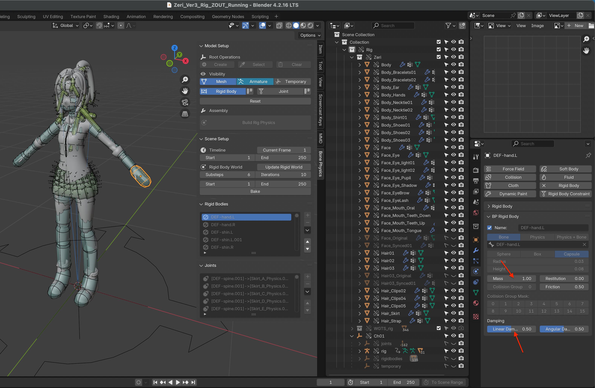

.. _link:

Linking & Library Overrides
============================

In Blender, *Linking* is a powerful feature that allows you to reuse assets across multiple projects without duplicating them.  
When you link an object or collection from an external ``.blend`` file, it remains read-only in the current project.  
To make changes, you need to create a *Library Override*, which generates a local editable copy of the linked data.

This workflow is especially useful for large projects and team collaboration, 
as it allows multiple scenes to share the same assets while ensuring that modifications are centralized in the source file.

However, when a character rig contains many rigid bodies and constraints, 
managing linked armatures, library overrides, and related physics settings can become complex.

To simplify this process, the add-on uses a :ref:`Root Empty <root-operations>` as the single parent object for all auxiliary objects, 
making *Linking* and *Library Overrides* easier to manage.

Link
------

When linking a character rig that uses this add-on,  
you typically only need to link one collection — the collection that contains the :ref:`Root Empty <root-operations>`.

In practice, character rigs are typically linked from a *rig file* into an *animation file*:

1. Choose :menuselection:`File --> Link` to open the Blender file browser.
2. Navigate to the ``.blend`` file that contains the rig.
3. Open the file and select the collection that contains the :ref:`Root Empty <root-operations>`.
4. Confirm the selection to link the collection into the current scene.

|

Library Overrides
-----------------------

After linking the collection, create a *Library Override* for it:

1. Select the linked collection in the *Outliner*.
2. Use :menuselection:`Right-click --> Library Override --> Make --> Selected & Content`.

Blender will generate local override data for all override-compatible objects in the collection.

|

.. note::

   Due to limitations in Blender's current override system, it may sometimes be necessary  
   to perform the override operation **twice** to ensure that all nested objects  
   (such as rigid bodies, constraints, and helper objects) are fully overridden.

   This behavior is a known Blender limitation and is not specific to this add-on.

.. important::
    After creating *Library Override*, you **Must** run :menuselection:`Update Rigid World`. See also :ref:`Update Rigid World <update-rigid-world>`.

    If this step is skipped, the physics simulation may fail to evaluate correctly or appear to do nothing in the animation file.

Overridable Properties
-----------------------

Due to the design of Blender's *Library Override* system, some properties cannot be edited locally and must be changed in the source file.

In addition, this add-on intentionally locks certain properties from local editing  
to prevent accidental changes to critical physics settings that could destabilize the simulation.

Non-overridable properties appear **Grayed Out** in the :ref:`Properties Panel <rigid_body_properties_panel>`.

|

If you need to modify these properties:

1. Open the source rig file.
2. Make the changes there.
3. Save the file.
4. Reload the overrides in the animation file.

.. warning::
    When adjusting overridable properties during animation — such as *Rigid Body Mass*  
    or *Joint Angle Limits*, always save your file first.

    Although these properties can technically be overridden, changing them during active physics evaluation may cause **Blender To Crash**
    due to instability in the physics solver.