.. _rigid_body:

Rigid Body
==============

.. _parameters:

Parameters
-------------------

This add-on uses Blender's built-in Rigid Body system for physics simulation,
so all parameters behave exactly as they do in Blender's native Rigid Body settings.

If you are already familiar with these parameters, you may skip this section.  

Otherwise, the following sections provide a practical overview of the key parameters along with real-world usage tips.

.. _mass:

Mass
^^^^
The **Mass** parameter defines the inertia of an object, i.e. its resistance to acceleration.

- **Acceleration response**: With the same applied force, heavier objects accelerate more slowly.  
- **Collision behavior**: A high-mass object will push lighter ones aside while being barely affected itself (conservation of momentum).  
- **Gravity**: Mass does not change the free-fall speed (gravity is constant), but it does affect impact forces.  
- **Rotational inertia**: Heavier objects are also harder to rotate due to larger inertia tensors.  

.. tip::
   The default value of ``1.0`` is neutral — you can treat it as a baseline and adjust other objects relative to it.

.. _friction:

Friction
^^^^^^^^
**Friction** controls how much resistance occurs when a Rigid Body slides across another surface.

- Higher values mean more resistance; objects slow down faster.  
- Lower values mean smoother surfaces, objects slide more easily.  

Blender uses its built-in Bullet physics engine to simulate Rigid Body dynamics.  
The engine computes the combined friction between two objects using Bullet's default formula:

.. math::

   friction_{total} = \sqrt{friction_A \times friction_B}

In practice, this means that if either object has a very low friction value, the resulting combined friction will also be low.  
Both objects must have sufficiently high friction values for the interaction to provide strong resistance.

.. tip::

    - ``0.0``: ice-like surface, endless sliding.  
    - ``0.2``: slippery floor, slow stop.  
    - ``0.5``: typical wood or desktop friction.  
    - ``0.8``: rubber-like, objects stop almost immediately.  
    - ``>1.0``: extreme values, objects barely move without a strong push.

.. _bounce:

Bounce
^^^^^^
The **Bounce** parameter defines how much energy is preserved in a collision, also known as the *Coefficient of Restitution (e)*.  
It only affects motion along the collision normal, not along the surface.

.. math::

   e = \frac{v_{after}}{v_{before}}

.. tip::

    - ``0.0``: perfectly inelastic — the object sticks to the surface (like clay).  
    - ``1.0``: perfectly elastic — the object bounces back with the same speed (idealized).  
    - ``0.0 ~ 1.0``: partially elastic, some energy is lost.

.. _linear-damping:

Linear Damping
^^^^^^^^^^^^^^
**Linear Damping** simulates drag forces (like air resistance) that slow down an object's motion when no external force is applied.  
It gradually reduces the object's linear velocity.

.. tip::

    - ``0.0``: no damping — the object slides forever, like on ice.  
    - ``0.04`` (default): slight drag, objects slowly come to rest.  
    - ``0.3``: noticeable drag, objects stop within a few seconds.  
    - ``1.0``: immediate stop, objects lose velocity almost instantly.

.. _angular-damping:

Angular Damping
^^^^^^^^^^^^^^^
**Angular Damping** controls how quickly an object's rotation slows down.
It works the same way as :ref:`linear-damping`, but affects angular velocity instead of linear velocity.

.. tip::

    - ``0.0``: spins like a top, never slows down.  
    - ``0.1`` (default): slight rotational drag, spin fades over time.  
    - ``0.3``: strong drag, object stops rotating in a few seconds.  
    - ``1.0``: rotation stops almost immediately.

Add Rigid Body
--------------

Quick Add
^^^^^^^^^^^^^^
1. Select the **Armature** and switch to *Pose Mode*.  
2. Choose the bone(s) that should receive a Rigid Body. 
3. Click the :menuselection:`+` button
4. Configure the properties and press :menuselection:`OK` to confirm.

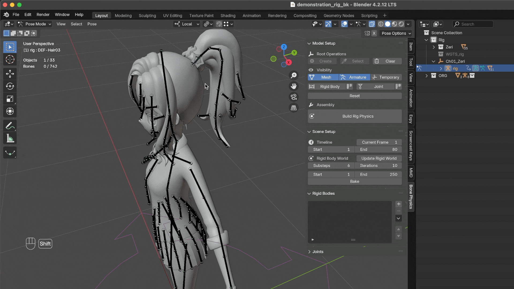

|

.. note::
   * You can find detailed explanations of all rigid body parameters in :ref:`Rigid Body Properties <rigid_body_properties>`.
   * ``$name`` is a placeholder that will use the name of the target bone as the rigid body's name.
   * When no bone is selected in *Pose Mode*, the add-on creates an :ref:`Auxiliary Rigid Body <auxiliary_rigid_bodies>` for the model.  
   * You can adjust the :ref:`Rigid Body Properties <rigid_body_properties>` at any time in the :ref:`Rigid Body Properties Panel <rigid_body_properties_panel>`.  

   * For **Rigify** armatures, it is recommended to:  
      * Attach rigid bodies of type ``Bone`` (i.e., fully bone-driven rigid bodies) to the ``DEF-`` bones.
        
        You can move and rotate the rigid bodies freely (in 3D viewport), and scale them (through the :ref:`Rigid Body Properties Panel <rigid_body_properties_panel>` ),  
        to fit the model's mesh contour as closely as possible and achieve more accurate physical simulation.  
        
        A single bone can drive multiple rigid bodies of this type, all of which follow the same bone transform.

        .. image:: images/addon_add_bone_rigid.png
            :align: center

      * Attach rigid bodies of type ``Physics`` or ``Physics + Bone`` (i.e., physics-driven rigid bodies) to the ``CTRL-`` bones.  
        
        To allow manual correction of physics results, two **Bone Collections** are required:  
        
        one named ``xxx_Physics`` that stores the bones directly controlled by the physics system,  
        and another that mirrors their rotation via ``Copy Rotation`` and uses ``Mix Before Original`` to support manual adjustments
        for fixing minor penetrations or undesirable motion.

        This modular structure helps isolate and debug issues efficiently.  
        For details on creating such bone collections and adding custom ones to a Rigify Armature:
        
        Check |youtube_link| or |bilibili_link| for the tutorial, or refer to the setup shown in the sample file.
        (**Note**: You may focus only on the part of the video demonstrating how to add bone collections; the cloth simulation section can be ignored.)

        .. |youtube_link| raw:: html
         
            <a href="https://www.youtube.com/watch?v=BKtVuqnCbK0" target="_blank">Youtube</a>

        .. |bilibili_link| raw:: html
         
            <a href="https://www.bilibili.com/video/BV16G4y1z7BD/?spm_id_from=333.1387.favlist.content.click&vd_source=b9589ad635db7dddd215259c55a8a09c" target="_blank">Bilibili</a>

        For ``Physics`` or ``Physics + Bone`` type rigid bodies, a single bone can also be bound to multiple rigid bodies. 
        During simulation, the bone will be driven by the rigid body with the greatest mass,  
        while the others act as auxiliary bodies.

   * With other rigs or custom armatures, make sure that all bones participating in the physics simulation  
     have corresponding **control bones**, allowing you to override the simulation when necessary and prevent mesh intersections or penetrations.

.. _save_presets:

Save Presets
^^^^^^^^^^^^^^
You can save presets for reuse. This workflow is very useful in practice, as it can save a significant amount of time!

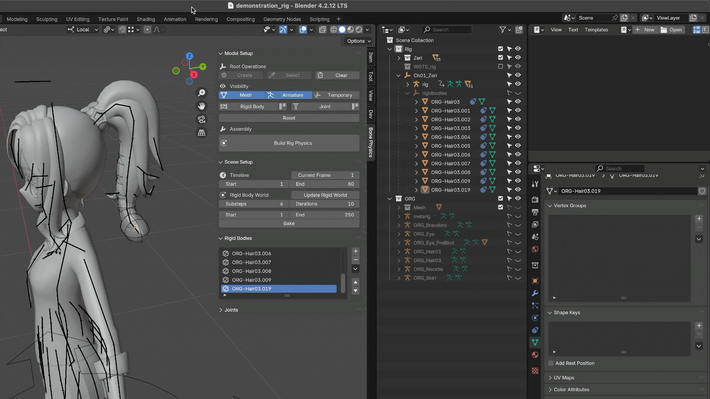

|

.. _rigid_body_properties:

Rigid Body Properties
----------------------

- **Name**: The name of the Rigid Body.  
- **Collision Group**: Collision group assigned to this object.  
- **Collision Group Mask**: Groups that this object should **Not** collide with.  
- **Rigid Type**:

  * ``Bone``: The rigid body follows the orientation of the attached bone.  
  * ``Physics``: The bone's transform is fully driven by the rigid body.  
  * ``Physics + Bone``: The bone's position follows its parent, but its rotation is copied from the rigid body.  

- **Shape**: Collision shape type.  
- **Outward Axis**: Local bone axis that points "outward".  
- **Size**: Dimensions of the collision shape, scaled relative to the target bone length.  
- **Mass**: :ref:`Mass <mass>`.  
- **Friction**: :ref:`Friction <friction>`.  
- **Bounce**: :ref:`Bounce <bounce>`.  
- **Linear Damping**: :ref:`Linear Damping <linear-damping>`.  
- **Angular Damping**: :ref:`Angular Damping <angular-damping>`.

.. warning::
    When modifying rigid body properties, always use the add-on's :ref:`Rigid Body Properties Panel <rigid_body_properties_panel>`.  
    Do not edit them through Blender's built-in interface.

.. note::
   * ``Physics`` vs ``Physics + Bone``
      * ``Physics``: The bone's location and rotation are completely determined by the rigid body. The rigid body may move the bone away from the Armature.
      * ``Physics + Bone``: The bone's position is still driven by its parent, but its rotation is copied from the rigid body. This prevents the bone from detaching while still inheriting the physical simulation results.

   * ``Outward Axis``
      When using **box-shaped** rigid bodies (**sphere** or **capsule** shapes can ignore this setting) to simulate skirt physics, 
      make sure that the target bones already have the correct local orientation —  
      either **Z Outward** or **X Outward**.  
      
      Then, when adding the rigid body, simply set ``Outward Axis`` to ``Z`` or ``X`` accordingly. 
      
      This ensures that the newly added rigid body inherits the correct initial rotation:  
      
      - The **Z-axis** aligns with the bone direction,  
      - The **Y-axis** points outward along the skirt's normal,  
      - The **X-axis** runs tangentially along the skirt surface.  
      
      |
      
      .. rubric:: Comparison: Correct vs Incorrect Setup

      .. figure:: images/addon_rigid_body_axis_correct.png
         :alt: Correct bone orientation with matching Outward Axis
         :align: center
         :width: 80%

         **Correct Setup** — The rigid body aligns perfectly with the mesh.

      .. figure:: images/addon_rigid_body_axis_incorrect.png
         :alt: Incorrect bone orientation or mismatched Outward Axis
         :align: center
         :width: 80%

         **Incorrect Setup** — The rigid body appears twisted or offset.
      
    * **Size**  
        In the preset panel, all shapes have three components (``x, y, z``). 
        However, the number of components required varies by shape: 

            - *Sphere*: only radius (use ``x``).  
            - *Box*: width, height, depth (use ``x, y, z``).  
            - *Capsule*: radius (hemisphere) and height (use ``x, y``).

        It is recommended to keep the default values in the preset panel and 
        make any necessary fine-tuning in the :ref:`Rigid Body Properties Panel <rigid_body_properties_panel>`.

.. _rigid_body_properties_panel:

Rigid Body Properties Panel
----------------------------

The *Rigid Body Properties Panel* is where you can view and edit rigid body attributes.  
It can be found under the *Physics Tab* in Blender.  

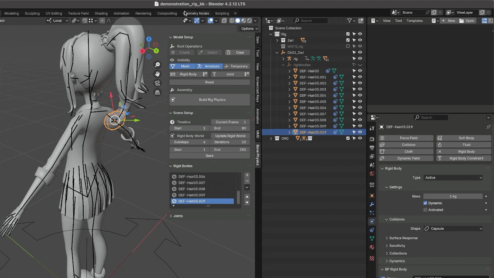

|

.. warning::

   For consistency and to avoid unintended errors, all rigid body attributes **Must** be modified via the add-on's *Rigid Body Properties Panel*.

.. note::

   Some properties can still be edited through Blender's default UI, and these actions cannot be blocked.  
   For example:

   - Physical parameters such as :ref:`Mass <mass>` and :ref:`Friction <friction>` can still be edited in the *Physics Tab*.
   - Scaling a rigid body in the 3D viewport with the :menuselection:`S` key.  

   However, editing through Blender's defaults will bypass the add-on's callbacks.  
   These callbacks may perform important tasks such as updating data, reassigning materials, or adjusting constraints.  

   **Example - Scaling in the 3D viewport:**  

   Using the :menuselection:`S` key only changes the **Visible Mesh**, the internal size data remains unchanged.  
   This can cause the **Visual Mesh** and the **Collision Shape** to diverge, leading to clipping or misalignment. 

.. _rigid_body_list:

Rigid Body List
----------------

The *Rigid Body List* shows all rigid bodies in the current scene.  

By default, it filters by :menuselection:`Active Model`, displaying only the rigid bodies of the currently selected model.  
To view rigid bodies from all models, change the filter to :menuselection:`All Models`.

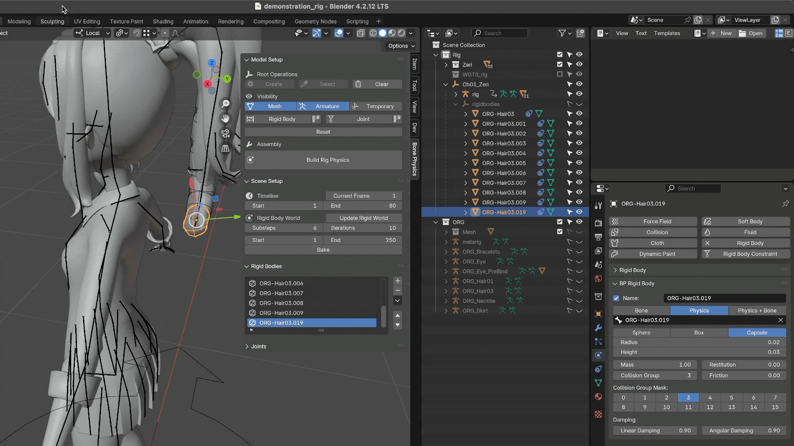

|

Reordering List Items
^^^^^^^^^^^^^^^^^^^^^^^^^^^^
You can reorder list items using the :menuselection:`⬆` and :menuselection:`⬇` buttons, 
or through the right-side dropdown menu options: :menuselection:`Move To Top` and :menuselection:`Move To Bottom`.

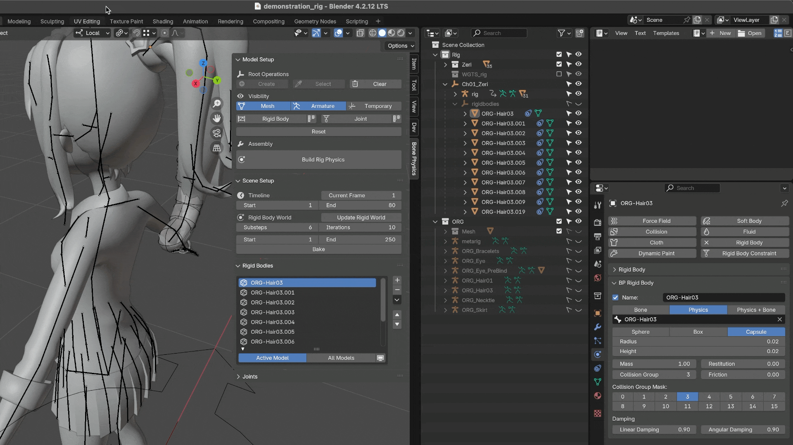

|

Error Indicators
^^^^^^^^^^^^^^^^^^^^^^^^^^^^

Missing Physics
~~~~~~~~~~~~~~~~
A list item will show a *"Missing Physics"* icon when its rigid body has no *Rigid Body Settings* component.  
To fix this, use the :menuselection:`Add Rigid Body` button in the :ref:`Rigid Body Properties Panel <rigid_body_properties_panel>` to restore the settings.

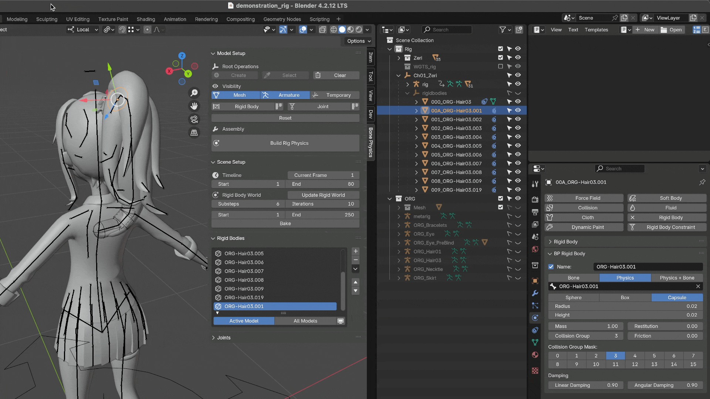

|

Missing Bone
~~~~~~~~~~~~
A list item will show a *"Missing Bone"* icon when its rigid body has no assigned bone.  
The missing bone can be reassigned in the :ref:`Rigid Body Properties Panel <rigid_body_properties_panel>`.

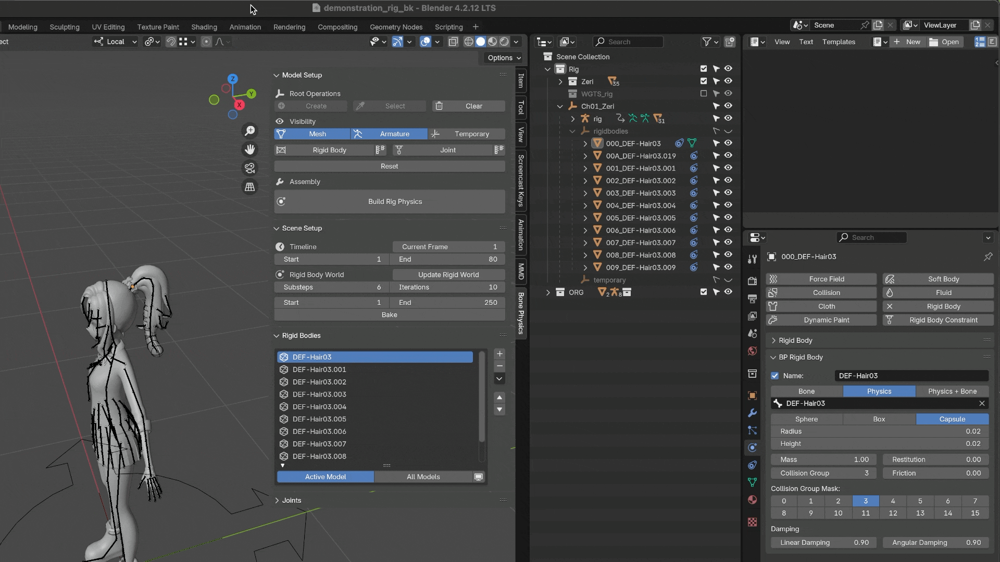

|

.. _select_rigid_bodies:

Select Rigid Bodies
--------------------

You can quickly perform batch selection of rigid bodies through :menuselection:`Select Similar` in the right-side menu.
This tool compares the properties of the active rigid body and selects all other rigid bodies that share the same values.

Properties for Comparison
^^^^^^^^^^^^^^^^^^^^^^^^^^^^

When invoking **Select Similar**, a pop-up dialog will appear, allowing you to choose which properties should be matched:

* :menuselection:`Collision Group`: Selects rigid bodies that share the same collision group number.
* :menuselection:`Collision Group Mask`: Selects rigid bodies that have the same collision mask configuration.
* :menuselection:`Rigid Type`: Selects rigid bodies that have the same rigid body type (e.g., ``Bone``, ``Physics``, ``Physics + Bone``).
* :menuselection:`Shape`: Selects rigid bodies that use the same collision shape.
* :menuselection:`Bone`: Selects rigid bodies bound to the same target bone.

These properties can be selected individually or in any combination.

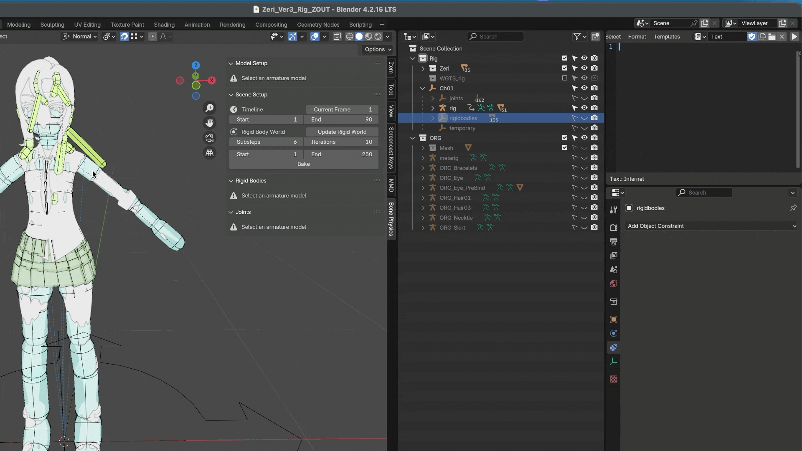

|

Hide Others
^^^^^^^^^^^^^^

The dialog also includes a *Hide Others* option:

* When enabled, all rigid bodies that do not match the chosen properties will be hidden.
* When disabled, unmatched objects remain visible but are simply not selected.

.. _remove_rigid_body:

Remove Rigid Body
-------------------

Select a rigid body in the *3D viewport*, the *Rigid Body List*, or the *Outliner*, then click the :menuselection:`-` button to remove it.

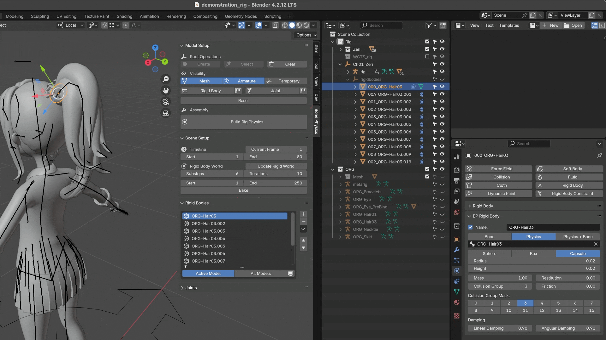

|

.. _auxiliary_rigid_bodies:

Example: Auxiliary Rigid Bodies
-------------------------------

When adding rigid bodies to the hair of a stylized character —  
especially for curved bangs or side locks — simply assigning a single rigid body to each bone often leads to an undesired effect:  

The hair strands will hang straight down under gravity during simulation.

However, stylized (non-realistic) hair should retain its designed shape and elasticity even in an **Idle** state.  
To reproduce this elastic behavior and maintain a smooth, natural motion during simulation,  
we introduce *Auxiliary Rigid Bodies* that influence the target Rigid Bodies,  
helping them maintain their intended modeled pose instead of collapsing under gravity.

The *Auxiliary Rigid Body* usually has the same mass as its target.  
By adjusting the **Angle** between them, or the **Length** of the *Auxiliary Rigid Body*,  
you can control the amount of torque it applies to the target and achieve the desired balance in simulation.

.. rubric:: Comparison: With vs. Without Auxiliary Rigid Bodies

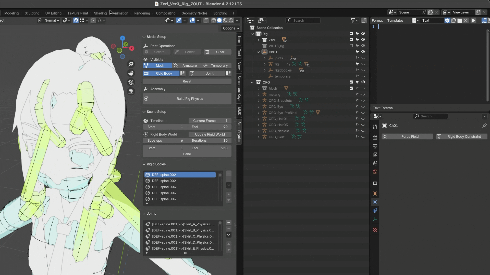

   **With Auxiliary Rigid Body** —  
   The target rigid body is supported by an angled *Auxiliary Rigid Body*, maintaining the stylized curvature and preventing it from drooping under gravity.  

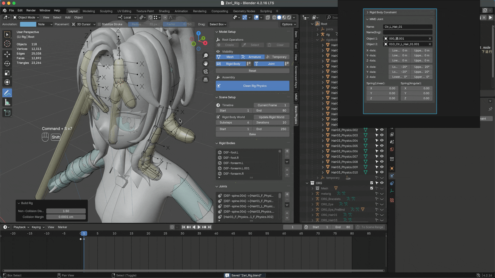

   **Without Auxiliary Rigid Body** —  
   The target Rigid Body is only constrained by gravity, causing the hair to fall straight down and lose its designed curvature.  

.. figure:: images/addon_mmd_sample.gif
   :alt: MMD model example using auxiliary Rigid Bodies
   :align: center
   :width: 80%

   **MMD Model Example** —  
   The “Nico” model uses multiple *Auxiliary Rigid Bodies* on the hair, keeping the hair elastic and lifted even in the idle pose. 