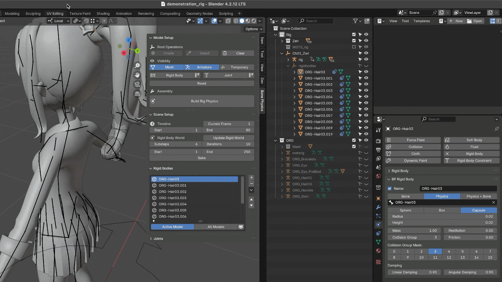
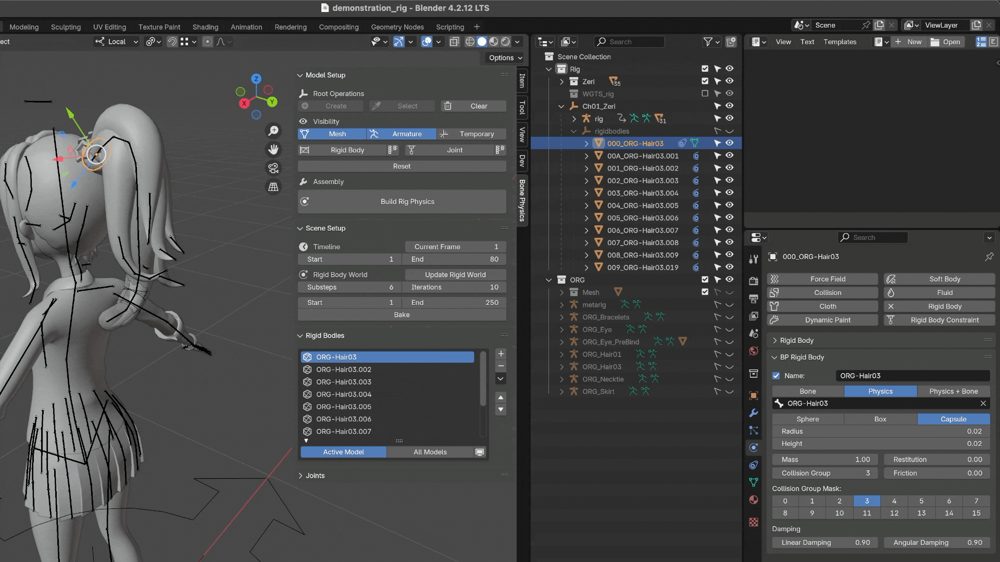

Rigid Body
==============

.. _parameters:

Parameters
-------------------

This add-on leverages Blender's built-in Rigid Body system for physics simulation,  
so all parameters function exactly as they do in Blender's native Rigid Body settings.  

If you are already familiar with these parameters, you may skip this section.  

Otherwise, the following chapters provide a practical overview of the key parameters along with real-world usage tips.

.. _mass:

Mass
^^^^
The **Mass** parameter defines the inertia of an object, i.e. its resistance to acceleration.

- **Acceleration response**: With the same applied force, heavier objects accelerate more slowly.  
- **Collision behavior**: A high-mass object will push lighter ones aside while being barely affected itself (momentum conservation).  
- **Gravity**: Mass does not change the free-fall speed (gravity is constant), but it does affect impact forces.  
- **Rotational inertia**: Heavier objects are also harder to rotate due to larger inertia tensors.  

.. tip::
   The default value of ``1.0`` is neutral — you can treat it as a baseline and adjust other objects relative to it.

.. _friction:

Friction
^^^^^^^^
**Friction** controls how much resistance occurs when a Rigid Body slides across another surface.

- Higher values means more resistance, objects slow down faster.  
- Lower values means smoother surfaces, objects slide more easily.  

Blender uses its built-in Bullet physics engine to simulate Rigid Body dynamics.  
The engine computes the combined friction between two objects using Bullet's default formula:

.. math::

   friction_{total} = \sqrt{friction_A \times friction_B}

In practice, this means that if either object has a very low friction value, the resulting combined friction will also be low.  
Both objects must have sufficiently high friction values for the interaction to provide strong resistance.

.. tip::

    - ``0.0``: ice-like surface, endless sliding.  
    - ``0.2``: slippery floor, slow stop.  
    - ``0.5``: typical wood or desktop friction.  
    - ``0.8``: rubber-like, objects stop almost immediately.  
    - ``>1.0``: extreme values, objects barely move without a strong push.

.. _bounce:

Bounce
^^^^^^
The **Bounce** parameter defines how much energy is preserved in a collision, also known as the *Coefficient of Restitution (e)*.  
It only affects motion along the collision's normal direction, not along the surface.

.. math::

   e = \frac{v_{after}}{v_{before}}

.. tip::

    - ``0.0``: perfectly inelastic — the object sticks to the surface (like clay).  
    - ``1.0``: perfectly elastic — the object bounces back with the same speed (idealized).  
    - ``0.0 ~ 1.0``: partially elastic, some energy is lost.

.. _linear-damping:

Linear Damping
^^^^^^^^^^^^^^
**Linear Damping** simulates drag forces (like air resistance) that slow down an object's motion when no external force is applied.  
It gradually reduces the object's linear velocity.

.. tip::

    - ``0.0``: no damping — the object slides forever, like on ice.  
    - ``0.04`` (default): slight drag, objects slowly come to rest.  
    - ``0.3``: noticeable drag, objects stop within a few seconds.  
    - ``1.0``: immediate stop, objects lose velocity almost instantly.

.. _angular-damping:

Angular Damping
^^^^^^^^^^^^^^^
**Angular Damping** controls how quickly an object's rotation slows down.
It works the same way as :ref:`linear-damping`, but affects angular velocity instead of linear velocity.

.. tip::

    - ``0.0``: top-like spinning, never slows down.  
    - ``0.1`` (default): slight rotational drag, spin fades over time.  
    - ``0.3``: strong drag, object stops rotating in a few seconds.  
    - ``1.0``: rotation stops almost immediately.

Add Rigid Body
--------------

Quick Add
^^^^^^^^^^^^^^
1. Select the **Armature** and switch to *Pose Mode*.  
2. Choose the bone(s) that should receive a Rigid Body. 
3. Click the **➕ button**
4. Configure the properties and press **OK** to finish.

.. image:: images/addon_add_rigid_body.gif
	:align: center

|

.. note::
    * When no bone is selected in *Pose Mode*, the add-on creates an **auxiliary Rigid Body** for the model.  
    * You can adjust the :ref:`Rigid Body Properties <rigid_body_properties>` at any time in the :ref:`Rigid Body Properties Panel <rigid_body_properties_panel>`.  

    * For **Rigify** armatures, it is recommended to:  
      
      * Bind Rigid Bodies of type ``Bone`` (i.e., fully bone-driven rigid bodies) to the ``DEF-`` bones.
        You can move and rotate the rigid bodies freely, and scale them (through the :ref:`Rigid Body Properties Panel <rigid_body_properties_panel>`),  
        to fit the model's mesh contour as closely as possible and achieve more accurate physical simulation.  
        A single bone can drive multiple rigid body objects of this type, all of which follow the same bone transform.

        .. image:: images/addon_add_bone_rigid.png
            :align: center

      * Bind Rigid Bodies of type ``Physics`` or ``Physics + Bone`` (i.e., physics-driven rigid bodies) to the ``CTRL-`` control bones.  
        To allow manual correction of physics results, two **Bone Collections** are required:  
        one named ``xxx_Physics`` that stores the bones directly controlled by the physics system,  
        and another that mirrors their rotation via *Copy Rotation* and uses *Mix Before Original* to support manual adjustments.  
        The second collection enables animators to fix minor penetrations or unwanted motion after the simulation is baked,  
        while still retaining the physics-driven motion in the ``xxx_Physics`` collection.  

        This modular structure helps isolate and debug issues efficiently.  
        For details on creating such bone collections and adding custom ones to a Rigify rig,  
        see the tutorial here: *YouTube link*.  

        For ``Physics`` or ``Physics + Bone`` type rigid bodies,  
        a single bone can also be bound to multiple rigid bodies.  
        During simulation, the bone will be driven by the rigid body with the greatest mass,  
        while the others act as auxiliary bodies.

    * With other rigs or custom armatures, make sure that all bones participating in the physics simulation  
      have corresponding **control bones**, allowing you to override the simulation when necessary  
      and prevent mesh intersections or penetrations.

.. _save_presets:

Save Presets
^^^^^^^^^^^^^^
You can save presets for reuse. This workflow is very useful in practice, as it can save a significant amount of time!

|

.. _rigid_body_properties:

Rigid Body Properties
----------------------

- **name**: The name of the Rigid Body.  
- **collision_group_number**: Collision group assigned to this object.  
- **collision_group_mask**: Groups that this object should *not* collide with.  
- **rigid_type**:

  * ``Bone``: The Rigid Body follows the orientation of the attached bone.  
  * ``Physics``: The bone's transform is fully driven by the Rigid Body.  
  * ``Physics + Bone``: The bone's position follows its parent, but its rotation is copied from the Rigid Body.  

- **rigid_shape**: Collision shape type.  
- **axis_outward**: Local bone axis that points outward.  
- **size**: Dimensions of the collision shape, scaled relative to the target bone length.  
- **mass**: See :ref:`Mass <mass>`.  
- **friction**: See :ref:`Friction <friction>`.  
- **bounce**: See :ref:`Bounce <bounce>`.  
- **linear damping**: See :ref:`Linear Damping <linear-damping>`.  
- **angular damping**: See :ref:`Angular Damping <angular-damping>`.

.. warning::
    When modifying Rigid Body properties, always use the add-on's :ref:`Rigid Body Properties Panel <rigid_body_properties_panel>`.  
    Do not edit them through Blender's built-in interface.

.. note::
    * **Name**
        ``$name`` is a placeholder that will use the name of the target bone as the Rigid Body's name.
    * **Physics vs Physics + Bone**
        ``Physic``: The bone's location and rotation are completely determined by the Rigid Body.
        The Rigid Body may move the bone away from the Armature.  
        
        ``Physics + Bone``: The bone's position is still driven by its parent, but its rotation is copied from the Rigid Body.
        This prevents the bone from detaching while still inheriting the physical simulation results.

   * **axis_outward**  
      When using **box-shaped rigid bodies** (**sphere** or **capsule** shapes can ignore) to simulate skirt physics, 
      make sure that the target bones already have the correct local orientation —  
      either **Z Outward** or **X Outward**.  
      Then, when adding the rigid body, simply set ``Outward Axis`` to ``Z`` or ``X`` accordingly. 
      
      This ensures that the newly added rigid body inherits the correct initial rotation:  
      
      - the **Z-axis** aligns with the bone direction,  
      - the **Y-axis** points outward along the skirt's normal,  
      - the **X-axis** runs tangentially along the skirt surface.  

      |

      .. rubric:: Importance of Correct Bone Orientation

      The following comparison illustrates the impact of bone orientation and ``Outward Axis`` settings:  

      .. figure:: images/addon_rigid_body_axis_correct.png
         :alt: Correct bone orientation with matching Outward Axis
         :align: center
         :width: 80%

         **Correct Setup** — The bone's local axes are oriented consistently,  
         and the ``Outward Axis`` in the rigid body matches the bone's outward direction.  
         The rigid body aligns perfectly with the mesh, ensuring stable joint orientation and smooth motion.

      |

      .. figure:: images/addon_rigid_body_axis_incorrect.png
         :alt: Incorrect bone orientation or mismatched Outward Axis
         :align: center
         :width: 80%

         **Incorrect Setup** — The bone's local axes are rotated arbitrarily,  
         or the ``Outward Axis`` is misassigned.  
         The rigid body appears twisted or offset, and the resulting joints may flip or behave unpredictably during simulation.

      |

      Proper axis alignment guarantees that any subsequent **joints** added between rigid bodies  
      will also inherit a consistent orientation, resulting in a **stable, coherent, and visually natural** simulation system.
      
    * **size**  
        In the preset panel, all shapes have three components (``x, y, z``). 
        However, the number of components required varies by shape: 

            - Sphere: only radius (use the ``x`` component).  
            - Box: width, height, depth (use ``x, y, z``).  
            - Capsule: radius (hemisphere) and height (use ``x, y``).

        It is recommended to keep the default values in the preset panel and 
        make any necessary fine-tuning in the :ref:`Rigid Body Properties Panel <rigid_body_properties_panel>` for more precise control.

.. _rigid_body_properties_panel:

Rigid Body Properties Panel
----------------------------

The **Rigid Body Properties Panel** is where you can view and edit rigid body attributes.  
It can be found under the **Physics** tab in Blender.  

.. image:: images/addon_rigid_body_properties_panel.gif
   :align: center

|

.. warning::

   For consistency and to avoid unintended errors,  
   all rigid body attributes **must** be modified via the add-on's Rigid Body Properties Panel.

.. note::

   Some properties can still be edited through Blender's default UI, and these actions cannot be blocked.  
   For example:

   - Physical parameters such as :ref:`Mass <mass>` and :ref:`Friction <friction>` in the *Physics* tab.  
   - Scaling a rigid body in the 3D Viewport with the **S** key.  

   However, editing through Blender's defaults will bypass the add-on's callbacks.  
   These callbacks may perform important tasks such as updating data, reassigning materials, or adjusting constraints.  

   **Example - Scaling in the 3D Viewport:**  

   Using **S** only changes the visible mesh; the internal size data remains unchanged.  
   This can cause the *visual mesh* and the *collision shape* to diverge, leading to clipping or misalignment. 
   Another reason manual scaling should be avoided is that the Bullet physics engine requires ideal mathematical shapes (sphere, box, capsule, etc.),  
   and manual scaling can easily produce invalid or unstable simulation results. 

.. _rigid_body_list:

Rigid Body List
----------------

The **Rigid Body List** shows all rigid bodies in the current scene.  
By default, it filters by **Active Model**, displaying only the rigid bodies of the currently selected model.  
To view rigid bodies from **all models**, change the filter to **All Models**.

|

Reordering List Items
^^^^^^^^^^^^^^^^^^^^^^^^^^^^
You can reorder list items using the ⬆ and ⬇ buttons, or through the right-side dropdown menu options: **Move To Top** and **Move To Bottom**.

|

Error Icon Indicators
^^^^^^^^^^^^^^^^^^^^^^^^^^^^

Missing Physics
~~~~~~~~~~~~~~~~
A list item will show a **"Missing Physics"** warning when its rigid body has no **Rigid Body Settings** component.  
To fix this, use the **Add Rigid Body** button in the :ref:`Rigid Body Properties Panel <rigid_body_properties_panel>` to restore the settings.

.. image:: images/addon_rigid_body_missing_physics.gif
   :align: center

|

Missing Bone
~~~~~~~~~~~~
A list item will show a **"Missing Bone"** warning when its rigid body has no assigned bone.  
The missing bone can be reassigned in the :ref:`Rigid Body Properties Panel <rigid_body_properties_panel>`.

.. image:: images/addon_rigid_body_missing_bone.gif
   :align: center

|

.. _select_rigid_bodies:

Select Rigid Bodies
--------------------

TODO:

.. _remove_rigid_body:

Remove Rigid Body
-------------------

Select a rigid body in the 3D View, the Rigid Body List, or the Outliner, then click the ➖ button to remove it.

|