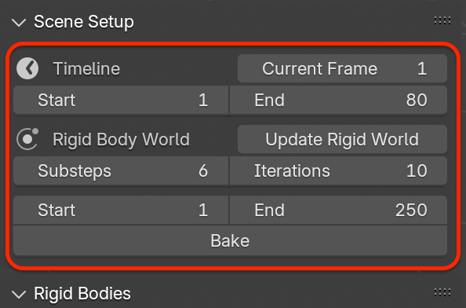
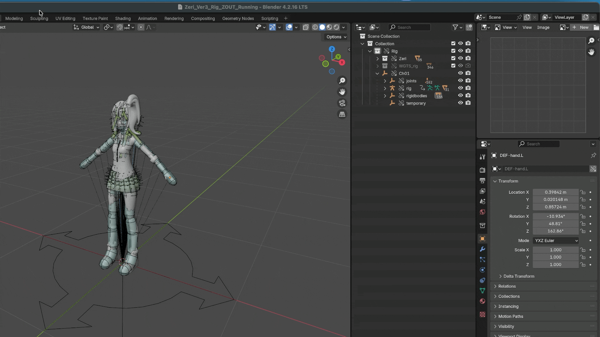

.. _scene:

Scene Setup
==============

This panel provides a centralized place to configure *Timeline*, *Rigid Body World*, 
and baking settings required for a stable physics simulation workflow.

|

Timeline
---------

The *Timeline* section displays and edits basic animation frame settings:

* ``Current Frame``: Displays the current frame of the scene timeline.
* ``Start`` / ``End``: Defines the playback range used for previewing and baking physics simulations.

These values are shared with Blender's main timeline.

Rigid Body World
-----------------

Blender's rigid body system relies on a scene-level container called the *Rigid Body World*, which manages:

* Global simulation settings (*solver iterations*, *substeps*, *gravity*)
* Collections that store rigid bodies
* Collections that store rigid body constraints

This add-on automatically manages these settings to ensure consistency.

.. _update-rigid-world:

Update Rigid World
^^^^^^^^^^^^^^^^^^^

Blender requires all rigid bodies and constraints to be placed in specific collections referenced by the *Rigid Body World*.

This operator ensures that all add-on objects are correctly registered in those collections.

Click :menuselection:`Update Rigid World` to synchronize the scene with the rigid body system.

|

This operation will:

* Ensure a valid *Rigid Body World* exists in the scene
* Create and assign required collections if missing
* Add all rigid bodies to the world collection
* Add all rigid body constraints to the constraint collection
* Fix broken references caused by:
  
  * Linked files
  * Library Overrides
  * Collection instances

.. note::
   If the button shows a warning icon, it indicates that the *Rigid Body World* settings differ from the recommended defaults and should be updated.

   This operator is safe to run at any time and is recommended whenever the scene structure changes.

.. tip::
   Why :menuselection:`Update Rigid World` Is Needed
   
   Blender's rigid body system relies on two internal collections:
   
   * A collection containing all rigid body objects
   * A collection containing all rigid body constraints
   
   When rigs are linked, duplicated, or overridden, these references may become outdated or invalid.
   
   The :menuselection:`Update Rigid World` operation rebuilds these references and ensures that all add-on objects are correctly registered in the simulation system.

Simulation Quality Settings
^^^^^^^^^^^^^^^^^^^^^^^^^^^

The following parameters control simulation accuracy and stability:

* :menuselection:`Substeps`: Number of physics substeps per frame. Higher values improve stability for fast-moving or lightweight objects.
* :menuselection:`Iterations`: Solver iteration count per substep. Higher values result in more accurate constraint solving at the cost of performance.

.. note::
   These parameters correspond to Blender's Bullet physics solver settings.
   
   The add-on sets conservative default values that balance stability and performance for character-based physics.

Bake
-----

Rigid body simulations can be cached for stable playback and rendering.

* :menuselection:`Bake`: Bakes the rigid body simulation into Blender's point cache for the current frame range.
* :menuselection:`Delete Bake`: Clears the baked cache and restores the simulation to real-time evaluation.

When a bake exists:

* Timeline playback no longer recalculates physics
* Simulation results are deterministic
* Performance during animation playback improves

.. note::
   If you need to adjust rigid bodies or constraints, delete the bake first.

Workflow Notes
--------------

* Always run :menuselection:`Update Rigid World` after structural changes to the rig.
* Bake only after confirming the simulation behaves as expected.
* When working in a multi-file pipeline, run :menuselection:`Update Rigid World` after using :menuselection:`Link` or :menuselection:`Library Override` to avoid broken constraints.
