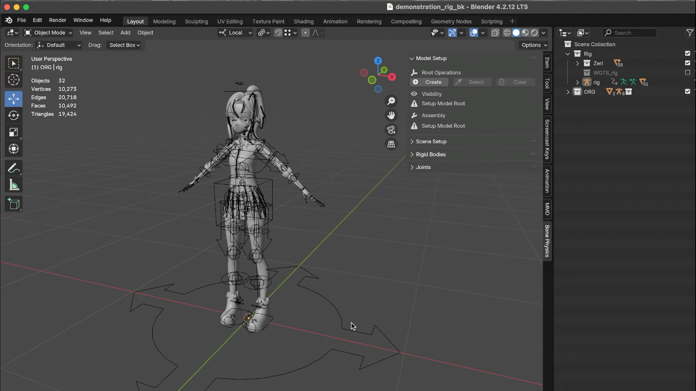
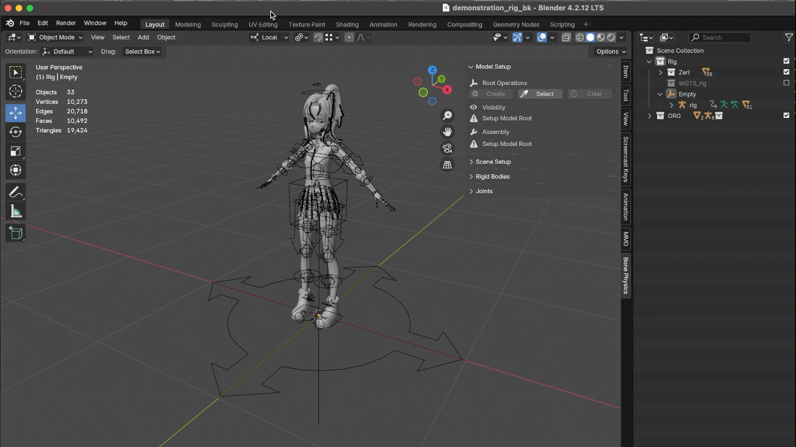

Model Setup
=============

Check Model
------------

Before you begin, make sure you have a properly prepared armature model. 
Double-check that the weights (vertex groups) are assigned correctly, especially for the bones that will participate in the physics simulation. 
Incorrect or overlapping weights are one of the most common causes of unexpected simulation issues.

.. important::
    | While the following setup steps are not strictly required, starting with these standards will help you avoid many common problems later:
    
    * Place the model at the world origin (0, 0, 0).
        This makes it easier to align with other assets and ensures consistency when exporting.
    * Face the -Y axis.
        In Blender, by convention characters usually face the negative Y direction. 
        This aligns better with many add-ons, rigging tools, and export pipelines (e.g. for game engines).
    * Apply all transforms (Ctrl + A > Apply All Transforms).
        Make sure location, rotation, and scale are all applied before rigging or running simulations. 
        Non-applied transforms can cause inconsistent bone behavior, incorrect physics, or scaling issues when importing into other software.

.. image:: images/blender_check_model.gif
	:align: center

|

Root Operations
-----------------

The purpose of **Root Operations** is to configure an **Empty** object as the `Root Empty` for the current armature model.  
Through this root object, all auxiliary elements used in physics simulation — such as rigid bodies, joints, or temporary helper objects — can be organized under a single parent.  

This approach makes it much easier to manage multi-character scenes in a clean and structured way. For example:  

* `Linking` and `Library Overrides` become straightforward, since you only need to link a single collection.  
* You can also attach custom-purpose objects to the root, such as special effect emitters, camera focus targets, or gameplay markers — a workflow that is very common in game development.  

Although this add-on **requires** that every armature model must be placed under a `Root Empty`, we believe this is a reasonable and practical design choice.  

.. warning::  
   If you cannot accept this design, you will not be able to continue using the add-on.

There are two possible scenarios:  

* Your armature does **not yet have an empty parent** → use :ref:`create-root` to generate one.  
* Your armature **already has a direct empty parent** → use :ref:`select-root` to assign it as the root.  

.. _create-root:

Create Root
~~~~~~~~~~~~

This operation creates a new **Empty** object as the parent of the selected armature model, serving as its root.  

|

* You can set the Empty's **name**, **display type**, and **scale**.
* The root will be created at the **armature model's current location** and will automatically become its parent. 
  (Therefore, we recommend placing the armature at the **world origin**) 
* Once the root is created, the armature's **transform** (Location, Rotation, Scale) will be **locked**. 
* Finally, the armature will be set to **Show in Front** , which helps keep it visible over other objects.

.. _select-root:

Select Root
~~~~~~~~~~~~

This operation allows you to select an existing **direct parent** of the selected armature as its root. 

    
|

* Currently, only **direct parents that are Empty objects** are supported. 
* Although the Empty does **not have to coincide with the armature's origin**, it is recommended to align them for cleaner transformations.
* Once the root is selected, the armature's **transform** (Location, Rotation, Scale) will be **locked**.
* Finally, the armature will be set to **Show in Front**, which helps keep it visible over other objects.

Clear Model
-------------

This operation removes all **rigid bodies** and **constraints** under the `rigidbodies`, `joints`, and `temporary` groups.
It will also **unlock the armature's transform** (Location, Rotation, Scale).
After performing a *Clear* operation, you may also choose to delete the `Root Empty` object if it is no longer needed.

.. caution:: 
    | Clearing everything will remove all physics-related data. Once deleted, the model can no longer participate in physics simulation unless the setup is rebuilt.